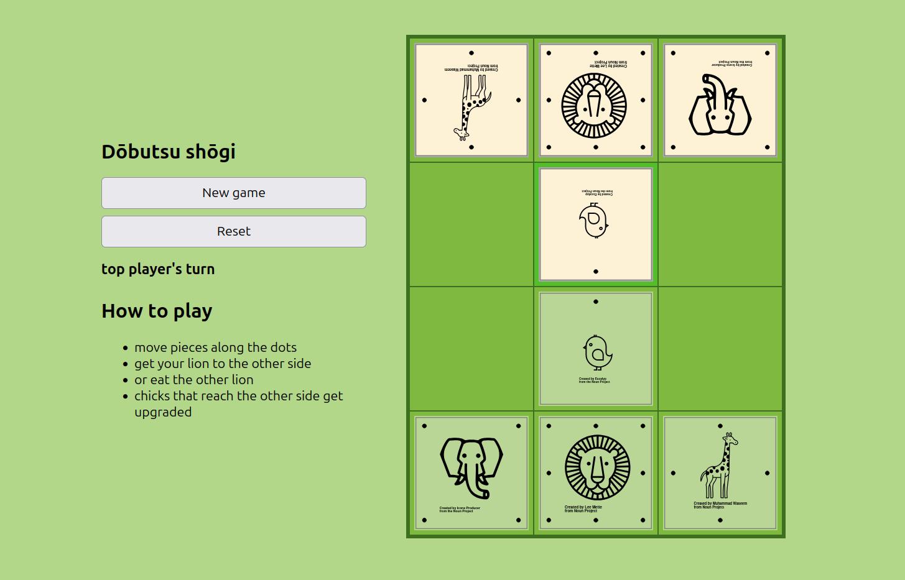

# Dōbutsu shōgi

**Three short tutorials on Python software engineering**

*by Dr. Kristian Rother*

[www.academis.eu](https://www.academis.eu)

## What this repo is about

This repository contains Dōbutsu shōgi, a tactical kids game from Japan.
It can be used as an example program for exercises on:

- debugging
- type annotations
- refactoring

## How the program works

The program consists of

- ``shogi.py`` – the game mechanics
- ``app.py`` – a FastAPI REST interface
- ``index.html`` – a web front-end
- ``test_shogi.py`` – automated tests

## Usage with uv

First, open a terminal in any of the three folders (``debugging/`` , ``type_annotations/`` or ``refactoring``).

Install and start the server with ``uv`` from a terminal:

    pip install uv
    uv sync
    uv run fastapi run --reload app.py

then visit localhost:3000 in your browser.

## Running the tests

Run the tests with:

    uv run pytest

## License

(c) 2026 Dr. Kristian Rother

Available under the conditions of the Creative Commons Attribution Share-alike License 4.0
(CC-BY-SA 4.0). See [www.creativecommons.org](https://www.creativecommons.org) for details.

## Contact

``kristian.rother@posteo.de``
