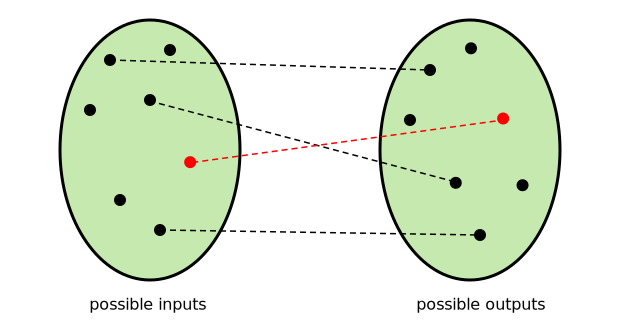
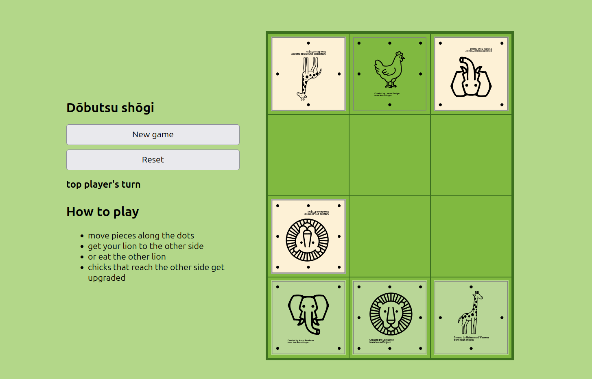

# Debugging

This folder contains a buggy version of the shogi game. 

**by Dr. Kristian Rother**

[www.academis.eu](https://www.academis.eu)

## Goals of this tutorial

In this tutorial you fix a bug in a small Python program.
It is a playground to experiment with debugging techniques.
In debugging, you are generally interested in finding out:

- find out why a bug occurs
- make sure the bug never comes back
- get ideas how to improve the program

---

## Why debugging is necessary



the amount of possible inputs and outputs is huge. It is practically impossible to verify that all pairs are correct.

---

## Error propagation


Defects change the **internal state** of the program. They may become apparent to the user much later.

---

## How to get started

Download or clone the repository. 
Install and start the code in `debugging/` with ``uv`` from a terminal:

    pip install uv
    uv sync
    uv run fastapi run --reload app.py

then visit localhost:8000 in your browser.

## The bug

When playing the game, you should be able to find a bug: when you move a chick to the other side of the playing field, a **ghost chicken** appears.
The ghost chicken cannot be moved by either player:



---

## Tracer bullets

As the first technique, inspect the internal state of the program.
Add a `print()` command to `make_move()` in `app.py`.

For convenience, use the `pprint` module:

```
from pprint import pprint

pprint(field)
```

---

## Breakpoints

Let's examine more closely what happens. As a second step, trace the program execution in slow motion:

- add `breakpoint()` to `shogi.execute_move()`
- run the program
- at the breakpoint you can inspect and modify variables or step through the program in slow motion

Use any of the following Debugger commands:

| command | explanation |
|---|---|
| l | list code lines |
| n | execute next line |
| s | step into function |
| c | continue execution |
| q | quit |

---


## Write a test against the bug

Once you have found the issue, make sure it never comes back.

Add another test in `test_shogi.py` that tests the buggy situations **before fixing the bug**.

Then run the tests again with

    uv run pytest

Fix the bug and run the tests again.

---

## Links

- slides on: [www.academis.eu/shogi](https://www.academis.eu/shogi)
- solutions on: [www.github.com/krother/shogi](https://www.github.com/krother/shogi)
- [easy exercise](https://www.academis.eu/python_basics/debugging/README.html)
- [intermediate exercise](https://www.academis.eu/advanced_python/error_handling/debugging.html)
- [Video Tutorial (PyData 20217)](https://www.youtube.com/watch?v=04paHt9xG9U)
